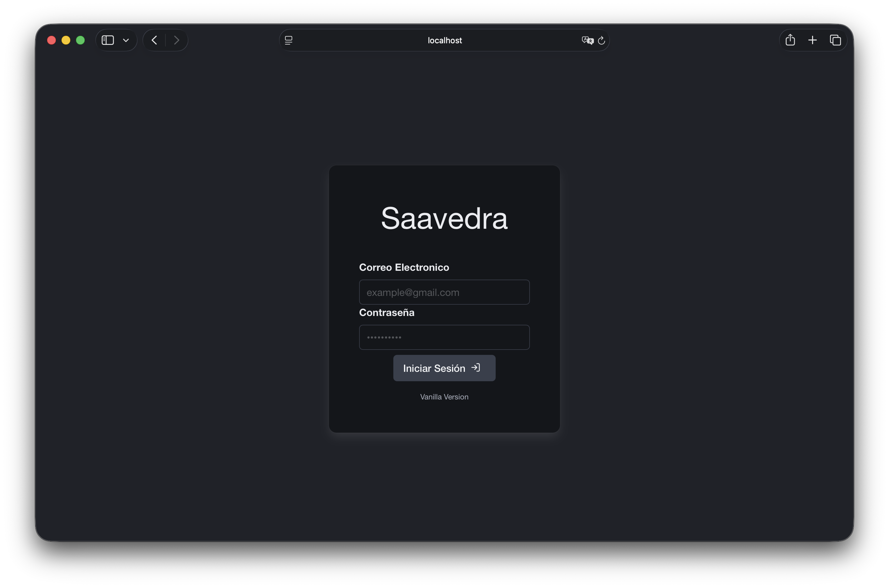
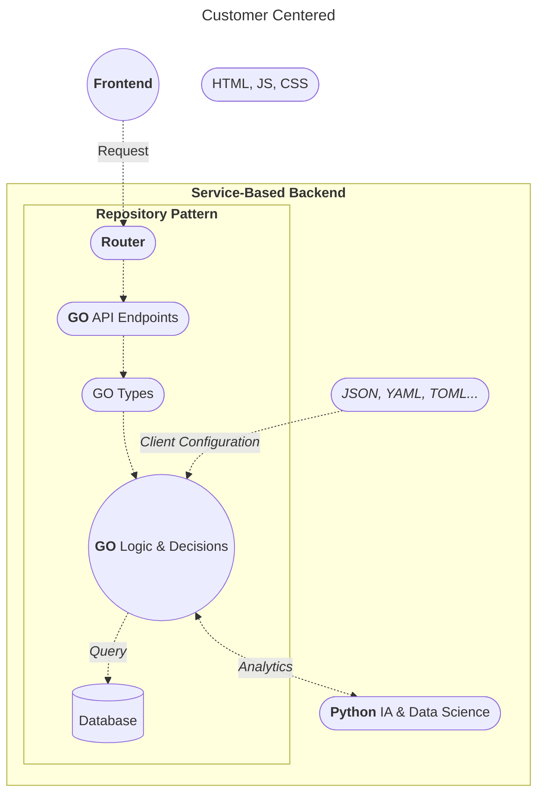
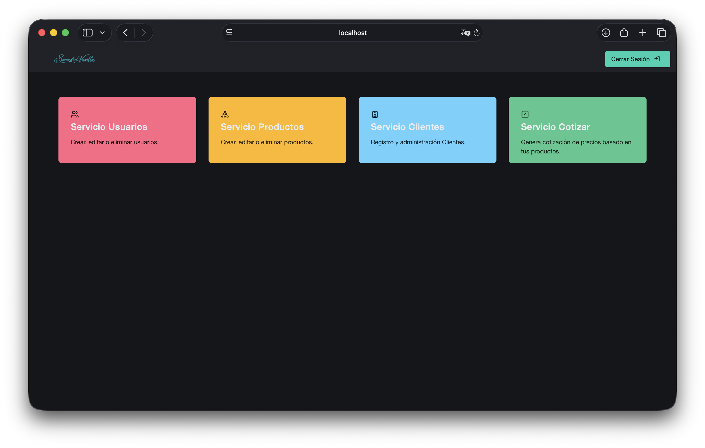
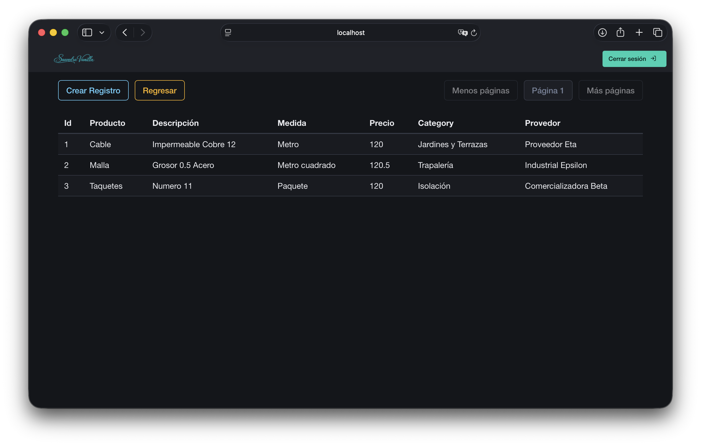
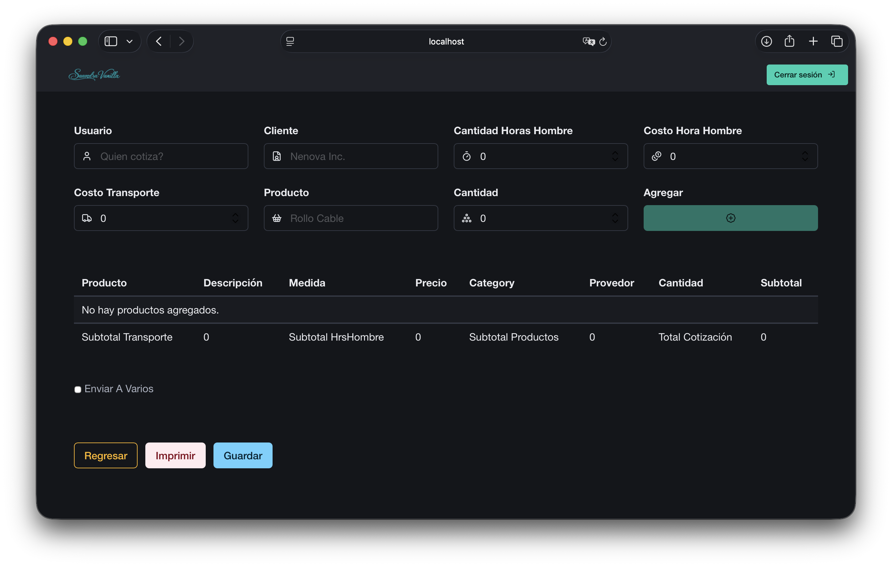

# Saavedra

_Así como Don Quijote, me hallo luchando contra molinos de viento. ¿Serán reales?_


## About

**Saavedra** is a Customer-Centered software architecture for building highly customized business applications through loosely coupled services and explicit boundaries.



The project explores a simple architectural proposition:

> **When the cost of producing software decreases, architectural generalization does not always have to increase with it.**

Instead of building a highly generalized system capable of representing every possible business domain, Saavedra favors **small, explicit, replaceable components** that can be adapted to a specific business without forcing unrelated parts of the system to change.

The architecture prioritizes:

* Explicit contracts
* Loose coupling
* Minimal metaprogramming
* Selective code reuse
* Service-oriented organization
* Repository Pattern
* REST APIs
* Relational persistence
* Volatile configuration through structured files
* Clear dependency boundaries
* Replaceable business logic

---

## Architecture

Saavedra follows a **Customer-Centered** architecture in which the application is composed of relatively independent services.



### Architectural flow

A request enters through the **Router** and is directed toward the appropriate Go endpoint.

The endpoint works with explicit **types** and delegates business decisions to the **Service/Logic layer**.

The service can then:

* Query persistent data through the repository layer.
* Load volatile configuration from JSON, YAML, TOML, or similar sources.
* Request analytical or computational operations from Python.
* Return the resulting data through the API or server-rendered view.

The important characteristic is that these dependencies remain explicit.

For example, the business logic does not need to know how the frontend is implemented, while the frontend does not need to know how persistence is implemented.

---

## Layer Model

The logical request path can be summarized as:

```text
Request
   │
   ▼
Router
   │
   ▼
App
   │
   ▼
Service
   │
   ├──────────────► Store
   │                  │
   │                  ▼
   │              Database
   │
   ├──────────────► JSON / YAML / TOML
   │
   └──────────────► Python
                         │
                         ▼
                  Analytics / AI
```

The broader application structure follows:

```text
DB → Store → Service → App → Router → HTML/CSS → JS → Request
```

Each layer has a defined responsibility rather than acting as a generic abstraction over the entire application.

---

## Data Strategy

Saavedra distinguishes between **persistent historical data** and **volatile application data**.

### Database

SQLite is used as the persistent source of historical truth.

```text
Database
   │
   ├── Users
   ├── Customers
   ├── Products
   ├── Quotes
   └── Other persistent entities
```

The database represents information that must survive application changes and remain historically consistent.

### Structured Files

JSON, YAML, TOML, and similar formats are used for information that does not necessarily belong in the relational model.

Examples include:

```text
Client configuration
Application settings
UI configuration
Feature configuration
Volatile business parameters
```

This avoids forcing every client-specific configuration requirement into the relational schema.

The result is a deliberate distinction:

```text
Persistent facts       → Database
Volatile configuration → JSON / YAML / TOML
Analytical processing  → Python
Application logic      → Go
```

---

## Repository Pattern

Persistence is isolated behind repositories.

```text
Service
   │
   ▼
Repository
   │
   ▼
SQLite
```

The service layer therefore depends on the repository contract rather than directly coupling business logic to database operations.

This provides a clear boundary between:

```text
Business Logic
      │
      ▼
Data Access
      │
      ▼
Persistence
```

The repository is responsible for persistence concerns; the service is responsible for business decisions.

---

## Service Architecture

Services are the main units of business functionality.

A service follows a structure similar to:

```text
service/
└── Login/
    ├── router/
    ├── api/
    ├── service/
    ├── store/
    ├── types/
    └── views/
```

Each service can contain its own:

* Routes
* API endpoints
* Business logic
* Persistence layer
* Types
* Views

This allows functionality to be added, removed, or rewritten without requiring the entire application to be reorganized.

---

## Frontend





The frontend uses a hybrid **SSR + REST** approach.

```text
HTML
 │
 ├── CSS
 │
 └── JavaScript
       │
       └── Alpine.js
```

Server-Side Rendering provides the initial document structure, while JavaScript manages dynamic DOM behavior and client-side interactions.

REST endpoints provide structured access to backend functionality where dynamic requests are required.

The frontend is therefore not treated as a completely independent SPA by default. Instead, rendering and API communication are combined according to the needs of each feature.

---

## Backend

The primary backend implementation uses **Go**.

Go is responsible for:

* HTTP routing
* API endpoints
* Application flow
* Business logic
* Type definitions
* Service orchestration
* Persistence coordination

Python is used as a complementary computational layer for:

* Data analysis
* AI-related operations
* Scientific computing
* Specialized processing

The two environments remain separated by an explicit service boundary.

```text
                 ┌─────────────┐
                 │     Go      │
                 │ Application │
                 └──────┬──────┘
                        │
                 Service Boundary
                        │
                        ▼
                 ┌─────────────┐
                 │   Python    │
                 │ Analytics   │
                 └─────────────┘
```

---

## Authentication

Protected application resources use **JWT-based authentication**.

The authentication flow is conceptually:

```text
Client
  │
  │ Credentials
  ▼
Authentication
  │
  │ JWT
  ▼
Client
  │
  │ Authenticated Request
  ▼
Router
  │
  ▼
Protected Service
```

Secrets and environment-specific configuration are kept outside the source code.

---

## Project Structure

The current project structure is organized around services rather than purely around technical layers.

```text
.
└── Saavedra/
    │
    ├── assets/
    │   ├── css/
    │   ├── img/
    │   ├── src/
    │   │   ├── html/
    │   │   └── js/
    │   │       └── utils/
    │   └── web/
    │
    ├── config/
    │
    ├── db/
    │
    ├── env/
    │   └── env.go
    │
    ├── migration/
    │   ├── mLogin/
    │   └── mUsers/
    │
    ├── private/
    │   └── secrets.toml
    │
    ├── service/
    │   └── Login/
    │       ├── router/
    │       ├── api/
    │       ├── service/
    │       ├── store/
    │       ├── types/
    │       └── views/
    │
    ├── utils/
    │   └── utils.go
    │
    └── main.go
```

### Directory responsibilities

| Directory    | Responsibility                          |
| ------------ | --------------------------------------- |
| `assets/`    | Frontend resources                      |
| `config/`    | Application configuration               |
| `db/`        | Database-related resources              |
| `env/`       | Environment configuration               |
| `migration/` | Relational schema declarations          |
| `private/`   | Local secrets and private configuration |
| `service/`   | Business services                       |
| `utils/`     | Shared utilities                        |
| `main.go`    | Application entry point                 |

---

## Service Dependencies

Services can explicitly depend on other services.

The current dependency map includes:

```text
All
 ├── Welcome
 └── ServeAssets

Users
 └── Login

Quote
 ├── Product
 ├── Proveedor
 └── Customer
```

Dependency order is relevant when loading services and executing their migrations.

For example:

```text
Login
   ↓
Users
   ↓
Customer
   ↓
Quote
```

The dependency map provides a simple way to understand which services must exist before another service can operate.

---

## Current Implementation

Saavedra is currently implemented for a **technology business**, with quotation management as one of its main workflows.

The current implementation is intentionally business-specific.

This does not define the architectural boundary of Saavedra.

The architecture is designed so that business-specific services can be removed, replaced, or rewritten while preserving independent infrastructure and services that remain relevant.

For example:

```text
                 Saavedra
                    │
        ┌───────────┴───────────┐
        │                       │
 Business-specific          Reusable
 functionality              services
        │                       │
        ▼                       ▼
 Technology                  Auth
 quotations                 Routing
 Products                    Storage
 Suppliers                   Utilities
 Customers                   Infrastructure
```

The goal is not to make every possible business fit into one universal data model.

Instead, Saavedra provides a structure from which a new application can be composed by retaining the useful services and replacing the domain-specific ones.

**The architecture is already being used by a real business.**

---

## Generative AI as an Architectural Consideration

Saavedra considers generative AI part of the changing economics of software development.

The architecture therefore favors:

* Explicit boundaries.
* Small independent services.
* Low coupling.
* Replaceable implementations.
* Clear contracts.
* Limited metaprogramming.

These properties make it possible for individual components to be generated, rewritten, or adapted without requiring the entire system to change with them.

The architecture does **not** require AI-generated code.

The implementation of Saavedra has largely been written manually. AI is primarily used as a technical reference for documentation, conceptual clarification, debugging, and architectural discussion.

The distinction is intentional:

```text
Architecture
     │
     ▼
Defines boundaries and constraints
     │
     ▼
Implementation
     │
     ├── Human-written
     │
     └── AI-assisted when appropriate
```

The underlying hypothesis is that reducing the cost of implementation may change the point at which abstraction becomes economically worthwhile.

Instead of asking:

> "How can every implementation be generalized?"

the architecture asks:

> "Which abstractions actually reduce total system complexity?"

---

## Configuration

Clone the repository from Git Hub 📦

```bash
git clone https://github.com/AeroGenCreator/Saavedra.git
```

```bash
cd Saavedra
```

```bash
# Create your database directory backup. Important: Call it 'db'
mkdir -p db
```

Docker Commands 🐳

```bash
docker compose up
```

```bash
# Enter the container and run it.
docker compose exec -it saavedra bash

go run main.go
```

```bash
# Update changes
docker compose up --build saavedra
```

Required environment configuration: ⚙️

```env
# Token used to validate client requests
SESSION_TOKEN=

# SQLite database filename
DATABASE_FILE_NAME=

# Administrator credentials
ADMIN_NAME=
ADMIN_EMAIL=
ADMIN_PASSWORD=

# Set to FALSE in production
IS_PRODUCTION=

# Number of records fetched/displayed per list slice
RECORDS_PER_SLICE=

# Application port
PORT=8080
```

> **Security:** never commit production credentials, tokens, or private secrets to the repository.

---

## Frontend Dependencies

Saavedra currently uses the following frontend resources:

```html
<meta charset="UTF-8">
<meta name="viewport" content="width=device-width, initial-scale=1.0">

<link rel="stylesheet" href="/assets/web/lucide-font/lucide.css">
<link rel="stylesheet" href="/assets/css/saavedraCSS.css">
<link rel="stylesheet" href="/assets/css/bulma/css/bulma.min.css">

<script defer src="/assets/src/js/utils/utils.js"></script>

<!-- JavaScript for the current HTML file -->
<script defer src=""></script>

<script
    defer
    src="https://cdn.jsdelivr.net/npm/alpinejs@3.16.3/dist/cdn.min.js">
</script>
```

---

## Debugging

Saavedra can be debugged through the Go command-line debugger **Delve (`dlv`)**.

Start a debugging session:

```bash
dlv debug main.go
```

Set a breakpoint by file and line:

```text
(dlv) break utils/utils.go:30
```

Breakpoints can also be placed on functions:

```text
(dlv) break utils.FunctionName
```

The breakpoint target must correspond to executable code.

---

## Design Principles

Saavedra is built around a small set of architectural principles:

### 1. Explicit boundaries

Dependencies should be visible rather than hidden behind excessive abstraction.

### 2. Minimal metaprogramming

Metaprogramming is used only where it provides a concrete benefit.

### 3. Selective reuse

Code should be reused when reuse reduces complexity—not simply because duplication is traditionally considered undesirable.

### 4. Replaceable services

A business-specific service should be replaceable without forcing unrelated services to change.

### 5. Persistent truth

The database stores historical facts that need durable persistence.

### 6. Volatile configuration

Client-specific or frequently changing configuration can live outside the relational model.

### 7. Technology separation

Go, Python, the database, and the frontend communicate through explicit boundaries.

### 8. AI-compatible architecture

The system should be structured so that individual implementations can be assisted or rewritten without destabilizing unrelated components.

---

## Project Status

Saavedra is an actively evolving architecture and application.

It should be considered a **working engineering system rather than a finalized framework or formal academic model**.

The current implementation provides a real-world environment in which the architecture, service boundaries, persistence strategy, and development assumptions can be evaluated through continued use.

---

## License

License information will be added as the project reaches its next release stage.
